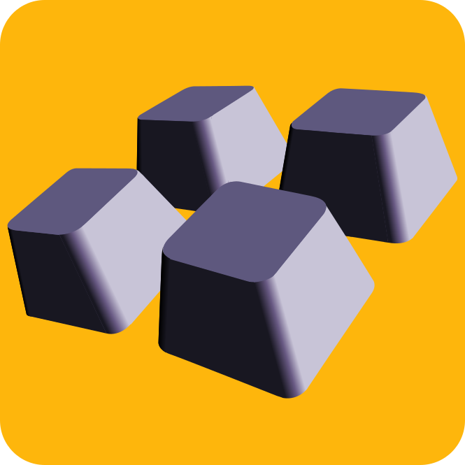

<!-- PROJECT LOGO -->
 

  

  <h3 align="center">Button Rig Plugins</h3>

  

    This repository contains source for free and open source Button Rig Plugins.
     
    <a href="https://docs.buttonrig.com/plugins"><strong>Build a Plugin! Explore the docs »</strong></a>
     
    <a>Report Bug</a>
    &middot;
    <a>Request Feature</a>
  

## Introduction
This repository contains source for plugins for Button Rig, a macro utility desktop application. You can purchase the application at <a href="https://buttonrig.com">buttonrig.com</a>.

<ul>
    <li>For the complete guide on how to develop a plugin, visit <a href="https://docs.buttonrig.com">docs.buttonrig.com</a>. </li>
    <li>Stuck on something? Feel free to ask for help in the forum at <a href="https://reddit.com/r/buttonrig">reddit.com/r/buttonrig</a>.</li>
    <li>Need us to develop a Button Rig Plugin for your software or business, reach out to us at <a href="mailto:contact@buttonrig.com">contact@buttonrig.com</a>.</li>
</ul>

## How to develop plugins for Button Rig?
Visit <a href="docs.buttonrig.com/plugins">docs.buttonrig.com</a> for the complete guide to create a plugin. This repository contains open-source/source-available plugins, which you can use as examples for building your plugin.

## PR
You can submit your plugin to this repository by raising a PR. Plugins in this repository will be bundled with the app. Therefore only high quality PRs and plugins will be accepted.